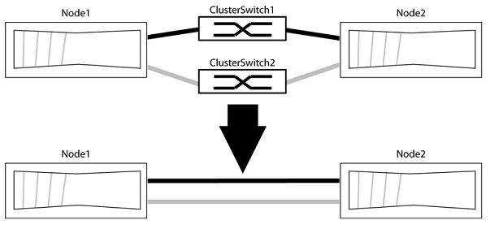

= 스위치를 직접 연결로 교체합니다
:allow-uri-read: 
:icons: font
:imagesdir: ../media/

클러스터 인터커넥트 스위치를 사용하는 2노드 클러스터가 있는 경우 스위치를 노드 간 직접 백 투 백 연결로 교체합니다. 이는 무중단 운영입니다.

.시작하기 전에
* 클러스터는 정상 상태이며 클러스터 스위치로 연결된 2개의 노드로 구성되어 있어야 하며 동일한 ONTAP 릴리즈를 실행 중이어야 합니다.
* 각 노드에는 시스템 구성을 지원하기 위해 중복 클러스터 인터커넥트 연결을 제공하는 데 필요한 수의 전용 클러스터 포트가 있어야 합니다. 예를 들어, 각 노드에 전용 클러스터 인터커넥트 포트 2개가 있는 시스템에 대한 이중화 포트 2개가 있어야 합니다.

다음 절차에서는 2노드 클러스터에서 클러스터 스위치를 제거하고 스위치에 대한 각 연결을 파트너 노드에 대한 직접 연결로 교체합니다.

다음 절차의 예는 클러스터 포트로 "e0a" 및 "e0b"를 사용하는 노드를 보여줍니다. 노드가 시스템에 따라 다를 수 있으므로 서로 다른 클러스터 포트를 사용하고 있을 수 있습니다.

.단계
. 권한 수준을 고급으로 변경하고 계속할 것인지 묻는 메시지가 표시되면 y를 입력합니다.
+
세트 프리빌리지 고급

+
고급 프롬프트 '*>'가 나타납니다.

. ONTAP 9.3 이상에서는 기본적으로 활성화되어 있는 스위치가 없는 클러스터에 대한 자동 감지를 지원합니다.
+
고급 권한 명령을 실행하여 스위치가 없는 클러스터 검색이 활성화되었는지 확인할 수 있습니다.

+
'네트워크 옵션 detect-switchless-cluster show'

+
다음 예제 출력은 옵션이 활성화되어 있는지 여부를 보여 줍니다.

+
[listing]
----
cluster::*> network options detect-switchless-cluster show
   (network options detect-switchless-cluster show)
Enable Switchless Cluster Detection: true
----
+
"스위치 없는 클러스터 검색 사용"이 "거짓"인 경우 지원 팀에 문의하십시오.

. 이 클러스터에서 AutoSupport가 활성화되어 있는 경우 AutoSupport 메시지를 호출하여 자동 케이스 생성을 억제합니다.
+
'System node AutoSupport invoke -node * -type all-message MAINT=<number_of_hours>h'

+
여기서 h는 유지 보수 기간(시간)입니다. 이 메시지는 유지 관리 작업 중에 자동 케이스 생성이 억제될 수 있도록 기술 지원 부서에 이 유지 관리 작업을 알립니다.

+
다음 예제에서는 명령이 2시간 동안 자동 케이스 생성을 억제합니다.

+
[listing]
----
cluster::*> system node autosupport invoke -node * -type all -message MAINT=2h
----
. 각 스위치의 클러스터 포트를 그룹으로 구성하여 group1의 클러스터 포트가 클러스터 스위치 1로 이동하고 group2의 클러스터 포트가 클러스터 스위치 2로 이동합니다. 이러한 그룹은 절차의 뒷부분에서 필요합니다.
. 클러스터 포트를 식별하고 링크 상태 및 상태를 확인합니다.
+
네트워크 포트 표시 - IPSpace 클러스터

+
클러스터 포트 "e0a" 및 "e0b"가 있는 노드의 경우 한 그룹이 "node1:e0a" 및 "node2:e0a"로 식별되고 다른 그룹은 "node1:e0b" 및 "node2:e0b"로 식별됩니다. 노드가 시스템에 따라 다르기 때문에 서로 다른 클러스터 포트를 사용할 수 있습니다.

+
image::../media/tnsc_clusterswitch_connections.PNG[노드 1과 노드 2 간의 클러스터 스위치 연결입니다]

+
다음 예와 같이 "Link" 열에 대한 포트 값이 "Up"이고 "Health Status" 열에 대한 값이 "Healthy"인지 확인합니다.

+
[listing]
----
cluster::> network port show -ipspace Cluster
Node: node1
                                                                 Ignore
                                             Speed(Mbps) Health  Health
Port  IPspace   Broadcast Domain Link  MTU   Admin/Oper	 Status  Status
----- --------- ---------------- ----- ----- ----------- ------- -------
e0a   Cluster   Cluster          up    9000  auto/10000  healthy false
e0b   Cluster   Cluster          up    9000  auto/10000  healthy false

Node: node2
                                                                 Ignore
                                             Speed(Mbps) Health  Health
Port  IPspace   Broadcast Domain Link  MTU   Admin/Oper	 Status  Status
----- --------- ---------------- ----- ----- ----------- ------- -------
e0a   Cluster   Cluster          up    9000  auto/10000  healthy false
e0b   Cluster   Cluster          up    9000  auto/10000  healthy false
4 entries were displayed.
----
. 모든 클러스터 LIF가 홈 포트에 있는지 확인합니다.
+
각 클러스터 LIF에 대해 "홈" 열이 "참"인지 확인합니다.

+
'network interface show-vserver Cluster-fields is-home'

+
다음 예와 유사한 출력이 표시됩니다.

+
[listing]
----
cluster::*> net int show -vserver Cluster -fields is-home
(network interface show)
vserver  lif          is-home
-------- ------------ --------
Cluster  node1_clus1  true
Cluster  node1_clus2  true
Cluster  node2_clus1  true
Cluster  node2_clus2  true
4 entries were displayed.
----
+
홈 포트에 없는 클러스터 LIF가 있는 경우 이러한 LIF를 홈 포트로 되돌립니다.

+
'네트워크 인터페이스 되돌리기 - vserver Cluster-lif *'

. 클러스터 LIF에 대한 자동 되돌리기 기능 해제:
+
'network interface modify -vserver Cluster-lif * -auto-revert false'

. 이전 단계에 나열된 모든 포트가 네트워크 스위치에 연결되어 있는지 확인합니다.
+
'network device-discovery show -port_cluster_port_'

+
"검색된 장치" 열은 포트가 연결된 클러스터 스위치의 이름이어야 합니다. 다음 예에서는 클러스터 포트 "e0a" 및 "e0b"가 클러스터 스위치 "CS1" 및 "CS2"에 올바르게 연결되어 있음을 보여 줍니다.

+
[listing]
----
cluster::> network device-discovery show -port e0a|e0b
  (network device-discovery show)
Node/     Local  Discovered
Protocol  Port   Device (LLDP: ChassisID)  Interface  Platform
--------- ------ ------------------------- ---------- ----------
node1/cdp
          e0a    cs1                       0/11       BES-53248
          e0b    cs2                       0/12       BES-53248
node2/cdp
          e0a    cs1                       0/9        BES-53248
          e0b    cs2                       0/9        BES-53248
4 entries were displayed.
----
. 클러스터 접속을 확인합니다.
+
'클러스터 ping-cluster-node local'

. 클러스터가 정상 상태인지 확인합니다.
+
'클러스터 링 쇼'

+
모든 단위는 마스터 또는 보조 단위여야 합니다.

. 그룹 1의 포트에 대해 스위치가 없는 구성을 설정합니다.
+

IMPORTANT: 잠재적인 네트워킹 문제를 방지하려면, 그룹 1에서 포트를 분리한 후 가능한 한 빨리(예: 20초 이내에 *) 다시 연결해야 합니다.

+
.. 그룹 1의 포트에서 모든 케이블을 동시에 분리합니다.
+
다음 예제에서 케이블은 각 노드의 포트 "e0a"에서 분리되고 클러스터 트래픽은 각 노드의 스위치 및 포트 "e0b"를 통해 계속됩니다.

+
image::../media/tnsc_clusterswitch1_disconnected.PNG[ClusterSwitch1의 연결이 끊겼습니다]

.. 그룹 1의 포트를 후면에서 케이블로 연결합니다.
+
다음 예제에서 노드 1의 "e0a"는 노드 2의 "e0a"에 연결되어 있습니다.

+
image::../media/tnsc_ports_e0a_direct_connection.PNG[포트 "e0a" 간 직접 연결]

. 스위치가 없는 클러스터 네트워크 옵션은 false에서 true로 전환됩니다. 이 작업은 최대 45초가 걸릴 수 있습니다. 스위치가 없는 옵션이 "참"으로 설정되어 있는지 확인합니다.
+
'network options switchless-cluster show'

+
다음 예는 스위치가 없는 클러스터가 활성화된 것을 보여줍니다.

+
[listing]
----
cluster::*> network options switchless-cluster show
Enable Switchless Cluster: true
----
. 클러스터 네트워크가 중단되어 있지 않은지 확인합니다.
+
'클러스터 ping-cluster-node local'

. 그룹 2의 포트에 대해 스위치가 없는 구성을 설정합니다.
+

IMPORTANT: 잠재적인 네트워킹 문제를 방지하려면, 그룹 2에서 포트를 분리한 후 최대한 빨리 다시 연결해야 합니다(예: 20초 이내 *).

+
.. 그룹 2의 포트에서 모든 케이블을 동시에 분리합니다.
+
다음 예제에서 각 노드의 포트 "e0b"에서 케이블이 분리되고 클러스터 트래픽은 "e0a" 포트 간 직접 연결을 통해 계속됩니다.

+
image::../media/tnsc_clusterswitch2_disconnected.PNG[ClusterSwitch2의 연결이 끊겼습니다]

.. 그룹2의 포트를 후면에서 케이블로 연결합니다.
+
다음 예제에서 노드 1의 "e0a"는 노드 2의 "e0a"에 연결되고 노드 1의 "e0b"는 노드 2의 "e0b"에 연결됩니다.

+
image::../media/tnsc_node1_and_node2_direct_connection.PNG[노드 1과 노드 2의 포트 간 직접 연결]

. 두 노드의 포트가 올바르게 연결되어 있는지 확인합니다.
+
'network device-discovery show -port_cluster_port_'

+
다음 예에서는 클러스터 포트 "e0a" 및 "e0b"이 클러스터 파트너의 해당 포트에 올바르게 연결되어 있음을 보여 줍니다.

+
[listing]
----
cluster::> net device-discovery show -port e0a|e0b
  (network device-discovery show)
Node/      Local  Discovered
Protocol   Port   Device (LLDP: ChassisID)  Interface  Platform
---------- ------ ------------------------- ---------- ----------
node1/cdp
           e0a    node2                     e0a        AFF-A300
           e0b    node2                     e0b        AFF-A300
node1/lldp
           e0a    node2 (00:a0:98:da:16:44) e0a        -
           e0b    node2 (00:a0:98:da:16:44) e0b        -
node2/cdp
           e0a    node1                     e0a        AFF-A300
           e0b    node1                     e0b        AFF-A300
node2/lldp
           e0a    node1 (00:a0:98:da:87:49) e0a        -
           e0b    node1 (00:a0:98:da:87:49) e0b        -
8 entries were displayed.
----
. 클러스터 LIF에 대해 자동 되돌리기 다시 설정:
+
'network interface modify -vserver Cluster-lif * -auto-revert true'

. 모든 LIF가 홈 상태인지 확인합니다. 몇 초 정도 걸릴 수 있습니다.
+
'network interface show -vserver cluster -lif_lif_name_'

+
다음 예제에서 노드1_clus2 및 노드2_clus2에 대해 표시된 것처럼 "홈" 열이 "참"이면 LIF가 되돌려집니다.

+
[listing]
----
cluster::> network interface show -vserver Cluster -fields curr-port,is-home
vserver  lif           curr-port is-home
-------- ------------- --------- -------
Cluster  node1_clus1   e0a       true
Cluster  node1_clus2   e0b       true
Cluster  node2_clus1   e0a       true
Cluster  node2_clus2   e0b       true
4 entries were displayed.
----
+
클러스터 LIF가 홈 포트로 돌아오지 않은 경우 수동으로 되돌리십시오.

+
'network interface revert-vserver cluster-lif_lif_name_'

. 두 노드 중 하나의 시스템 콘솔에서 노드의 클러스터 상태를 확인합니다.
+
'클러스터 쇼'

+
다음 예는 두 노드의 epsilon을 "거짓"으로 보여 줍니다.

+
[listing]
----
Node  Health  Eligibility Epsilon
----- ------- ----------- --------
node1 true    true        false
node2 true    true        false
2 entries were displayed.
----
. 클러스터 포트 간의 연결을 확인합니다.
+
클러스터 ping-cluster local이 있습니다

. 자동 케이스 생성을 억제한 경우 AutoSupport 메시지를 호출하여 다시 활성화합니다.
+
'System node AutoSupport invoke-node * -type all-message maINT=end'

. 권한 수준을 admin으로 다시 변경합니다.
+
'Set-Privilege admin'입니다

* 관련 정보 *

link:https://kb.netapp.com/Advice_and_Troubleshooting/Data_Storage_Software/ONTAP_OS/How_to_suppress_automatic_case_creation_during_scheduled_maintenance_windows_-_ONTAP_9["NetApp KB 문서 101010449: 예약된 유지 관리 창에서 자동 케이스 생성을 억제하는 방법"^]
