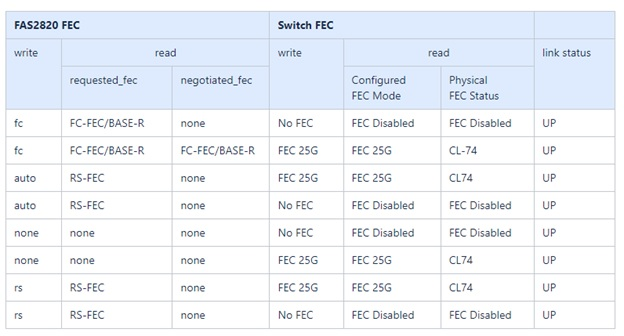

= 케이블링 및 구성 고려 사항 검토
:allow-uri-read: 
:icons: font
:imagesdir: ../media/

[role="lead"]
Broadcom BES-53248 스위치를 구성하기 전에 다음 고려 사항을 검토하세요.

== 클러스터 포트 스위치 할당

Broadcom에서 지원하는 BES-53248 클러스터 스위치 포트 할당 표를 가이드로 사용하여 클러스터를 구성할 수 있습니다.

|===

| *스위치 포트* | *포트 사용* 

 a| 
0-16
 a| 
10/25GbE 클러스터 포트 노드, 기본 구성

 a| 
17-48
 a| 
라이센스가 포함된 10/25GbE 클러스터 포트 노드

 a| 
49-54
 a| 
라이센스가 있는 40/100GbE 클러스터 포트 노드가 오른쪽에서 왼쪽으로 추가됩니다.

 a| 
55-56
 a| 
100GbE 클러스터 Inter-Switch Link(ISL) 포트, 기본 구성

|===
를 참조하십시오 https://hwu.netapp.com/Switch/Index["Hardware Universe"^] 스위치 포트에 대한 자세한 내용은 다음을 참조하세요.

== 포트 그룹 속도 제한

* BES-53248 클러스터 스위치에서는 48개의 10/25GbE(SFP28/SFP+) 포트가 다음과 같이 12 x 4포트 그룹으로 결합됩니다. 포트 1-4, 5-8, 9-12, 13-16, 17-20, 21-24, 25-28, 29-32, 33-36, 37-40, 41-44, 45-48.
* SFP28/SFP+ 포트 속도는 4포트 그룹의 모든 포트에서 동일해야 합니다(10GbE 또는 25GbE).
* 4포트 그룹의 속도가 다르면 스위치 포트가 올바르게 작동하지 않습니다.

== FEC 요구 사항

* 구리 케이블을 사용하는 25G 포트의 경우 자세한 내용은 다음 표를 참조하세요.
+
Controller 측이 `auto` 스위치 측은 FEC 25G로 설정됩니다.

+

* 광섬유/광 케이블을 사용하는 25G 포트의 경우 자세한 내용은 다음 표를 참조하세요.
+
image::../media/FEC_fiber_table.jpg[광섬유/광 케이블을 사용한 25G 포트]

=== Bootarg 구현

다음 명령을 사용하여 25G 포트 FEC를 다음 중 하나로 설정합니다. `auto` 또는 `fc` 필요에 따라:

[listing]
----
systemshell -node <node> -command sudo sysctl dev.ice.<X>.requested_fec=<auto/fc>
----
* 설정 시*`auto` *:
+
** 그만큼 `auto` 설정을 적용하면 하드웨어에 즉시 설정이 전파되며 재부팅이 필요하지 않습니다.
** 만약에 `bootarg.cpk_fec_fc_eXx already exists` , bootarg 저장소에서 삭제됩니다.
** 재부팅 후, `auto` 설정은 그 이후로 그대로 유지됩니다. `auto` 기본 FEC 설정입니다.

* 설정 시*`fc` *:
+
** 그만큼 `FC-FEC` 설정을 적용하면 하드웨어에 설정이 즉시 전파되며 재부팅이 필요하지 않습니다.
** 새로운 `bootarg.cpk_fec_fc_eXx` 값이 "true"로 설정되어 생성됩니다.
** 재부팅 후, `FC-FEC` 드라이버 코드가 사용할 수 있도록 설정이 그대로 유지됩니다.

